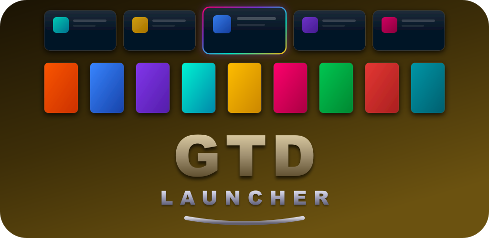
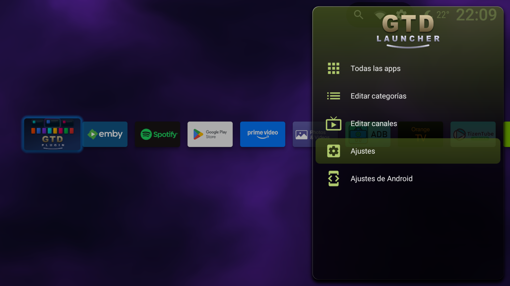
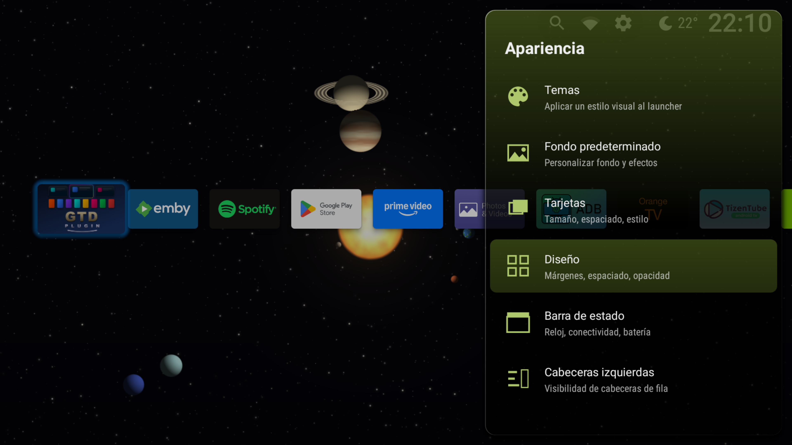
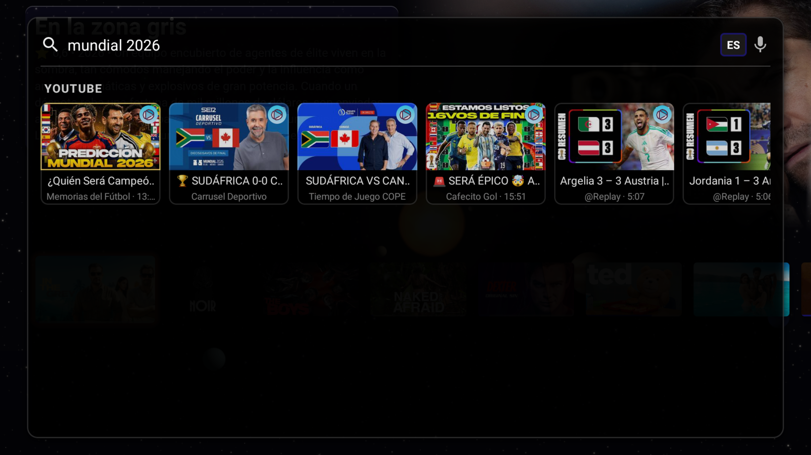
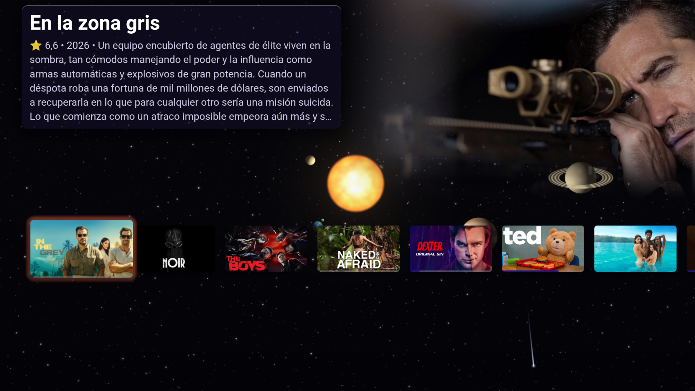
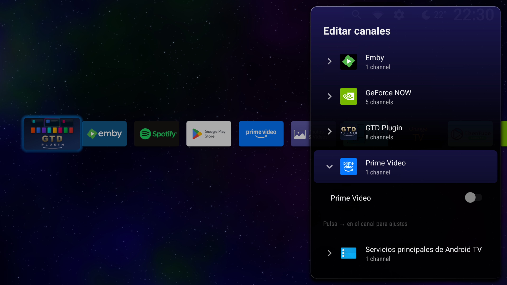
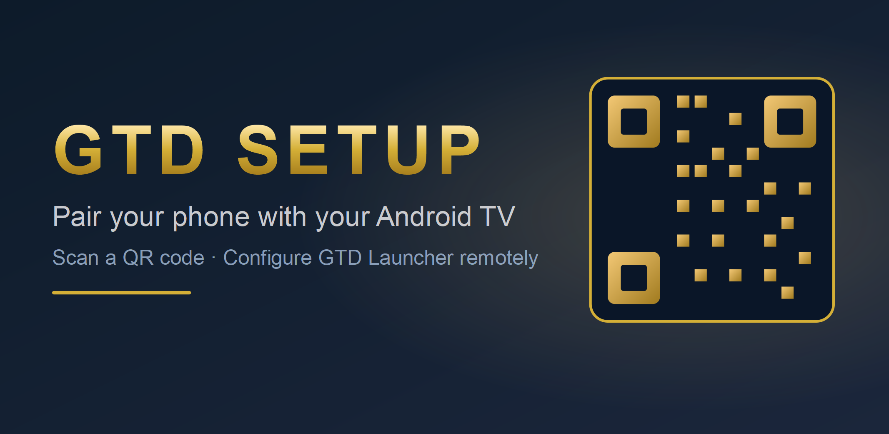

  

# GTD Launcher

A polished, fully customisable Android TV launcher. Native channels, themes, glass UI, focused-card glow, accent colours, per-app icons, multi-button remote remap, cloud backup. **Ad-free. No telemetry. No account.**

  
  
  
  

> Built by **GTD TV Studio**. Companion plugin: [GTD Plugin for Emby](https://github.com/GokuTD/gtd-plugin) · Mobile setup helper: [GTD Setup](#mobile-companion).

## Screenshots

<table>
  <tr>
    <td></td>
    <td></td>
    <td></td>
  </tr>
  <tr>
    <td align="center">Home with native channels</td>
    <td align="center">Glass-style side menu</td>
    <td align="center">Appearance &amp; glass customisation</td>
  </tr>
  <tr>
    <td></td>
    <td></td>
    <td></td>
  </tr>
  <tr>
    <td align="center">Universal search</td>
    <td align="center">Animated GL wallpapers</td>
    <td align="center">Channels &amp; categories</td>
  </tr>
</table>

---

## Free tier — what you get without paying

- Native Android TV channels — pin and reorder rows from any installed app
- Drag-and-drop apps, hide what you don't want, mark favourites
- Built-in search across every installed app
- **4 themes included**: Default · AMOLED · Arctic · Ocean
- Cards customisation (size, spacing, corners, shadow, background colour)
- Static custom wallpaper + plugin-sourced wallpapers
- Watch Next row populated from your media apps
- Local export/import of all settings as JSON
- Single-button remote remapping (your first remap is always free)
- Boot-direct (open at TV power-on)
- Custom screensaver picker
- Now Playing badge for currently-playing media
- 14 fully translated locales (EN, ES, FR, DE, IT, PL, PT, RO, RU, UK, ZH-rCN…)

## Premium features

One-time **€7** unlock that opens up:

- **8 extra premium themes** — Neon Night · Sunset · Forest · Ruby · Amethyst · Rose · Teal · Amber
- **Premium card glow** — RGB and Neon glow effects on focused cards
- **Wallpaper engine** — brightness, contrast, saturation, hue, blur, colour filter, multi-image slideshow
- **Per-app icons + icon packs** — override any app icon or apply a third-party icon pack
- **Multi-button remote remap** — map more than one remote button to apps
- **Cloud backup to Google Drive** — sync settings + auto-restore on reinstall
- **Status bar widgets** — extra widgets in the launcher status bar

No subscription. No recurring charges. Reinstall and Premium restores from your Google account automatically.

## Free vs Premium at a glance

|                          | Free | Premium (€7 one-time) |
|---|---|---|
| Themes                   | 4 presets | 12 presets |
| Custom wallpaper         | static images | + slideshow + adjustments |
| Card glow effects        | dynamic / colour | + RGB / Neon |
| Per-app icons            | — | ✅ |
| Icon packs               | — | ✅ |
| Multi-button remap       | 1 mapping | unlimited |
| Cloud backup             | local export | + Google Drive sync |
| Ads / Telemetry          | ❌ none | ❌ none |

## The GTD ecosystem

GTD Launcher is the core product, and it works on its own. Two optional companions extend it for power users:

### 🧩 [GTD Plugin for Emby](https://github.com/GokuTD/gtd-plugin) — Android TV

Adds everything that connects the launcher to your media stack:

- **Dynamic wallpapers** generated from your Emby library (4 free themes + 30 in Premium)
- **Ambient 4K HDR screensaver** with cinematic nature footage and your own Emby backdrops
- **Native Android TV channels** populated from Emby — Continue Watching, Latest Movies, Latest Shows, Live TV with EPG and PiP
- **Football overlays** — live scores, goal notifications, upcoming match cards for your favourite teams
- **Oppo UDP-203 / 205 remote** — control the disc player from the Shield mando over LAN (TCP / HTTP / NFS)
- **Samsung soundbar HDMI input switching** — pair the Oppo control with a one-tap source change

Free to install. Premium (€7 one-time, separate from the launcher) opens up the full theme catalog and the custom theme editor.

### 📱 [GTD Setup](https://github.com/GokuTD/gtd-launcher/releases) — phone companion

Pair your phone with the launcher by scanning a QR code shown on the TV setup wizard, then push your Emby login, IP addresses and API keys without typing them with the remote. Permanently free, no IAP.

  

Setup screenshots: [`screenshots-setup/`](./screenshots-setup).

## Documentation

- 📖 [FAQ](docs/FAQ.md) — most-asked questions
- 🛠️ [Sideload guide](docs/Sideload-Guide.md) — install without Play Store
- 📱 [Pairing with GTD Setup](docs/Pairing-Guide.md) — phone-to-TV setup
- 🐛 [Troubleshooting](docs/Troubleshooting.md) — common issues
- 💳 [Premium & Billing](docs/Premium.md) — what €7 unlocks

---

## Install

### Google Play Store

> 🟡 Pending Play Store approval. Status will be linked here as soon as the listing goes live.

### Sideload (free APK)

1. Download the latest `GTDLauncher-release.apk` from [Releases](https://github.com/GokuTD/gtd-launcher/releases).
2. Allow unknown sources on your TV: Settings → Security → Unknown apps.
3. Install via [Solid Explorer](https://play.google.com/store/apps/details?id=pl.solidexplorer2) / [X-plore](https://play.google.com/store/apps/details?id=com.lonelycatgames.Xplore) / `adb install GTDLauncher-release.apk`.
4. Set as Home: Settings → Apps → Default apps → Home app.

The sideloaded APK runs in **free mode** until you purchase Premium via Google Play (the in-app purchase reconciles via the Play Billing client and unlocks the full feature set).

### Mobile companion

For easier setup (Emby login, API keys, IP addresses) install **GTD Setup** on your phone — paired by QR code from the launcher's setup wizard. Download the latest signed APK from [Releases](https://github.com/GokuTD/gtd-launcher/releases) under "GTD Setup".

---

## Support

- **Bugs / feature requests** → [open an issue](https://github.com/GokuTD/gtd-launcher/issues/new/choose)
- **Email** → gokukinto@gmail.com
- **Privacy Policy** → https://gokutd.github.io/gtd-policy/

This repository hosts the public-facing README, screenshots, releases and issue tracker. The application source is closed; the repo contains no code.

---

© 2026 GTD TV Studio · All rights reserved
